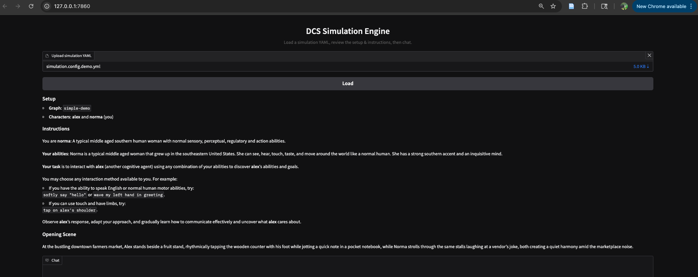

🚧 NOTICE: This is a W.I.P. (official releases will be tagged and licensed when ready)

# Diverse Cognitive Systems (DCS) Simulation Engine 


*A textual role-playing simulator for diverse cognitive systems to play and learn.*

[](https://simulation-api-demo.fly.dev:8000)          <!-- blue -->
[](https://simulation-widget-demo.fly.dev/) <!-- green -->
[](https://fuzzy-tribble.github.io/dcs-simulation-engine/) <!-- orange -->
[](https://github.com/fuzzy-tribble/dcs-simulation-engine/wiki) <!-- pink -->
[](https://github.com/fuzzy-tribble/dcs-simulation-engine/actions/workflows/ci.yml)

## What is this?

It's both a research framework and a play space.

For researchers, it offers a way to **study interactions between diverse cognitive systems in controlled, designed scenarios with reliablly simulated character responses**--from how neurodivergent humans collaborate on a task, to how AI systems with varying architectures generate communication protocols, to how neurotypical hummans interpret and engage with unfamiliar or radically different beings.

For players, it's a collaborative improv arena where a player character (you) and a simulated character take on a cast of characters with distinct abilities and cognitive profiles. Everything unfolds through language: actions, imagination, and world-building in a style inspired by tabletop roleplaying games.

Under the hood, it’s built to faithfully represent the actions and behavioral patterns of a curated range of real cognitive systems—from neurodivergent humans to simple mechanical homeostatic agents and biological systems with basal intelligence. This foundation supports rich, varied interactions that push participants to adapt and think differently, while giving researchers a structured way to observe and analyze the dynamics that emerge.

And the interface is delightfully simple:
*It runs on the world’s most powerful graphics chip: your imagination. Its controller? The world’s most powerful cognitive interface: symbolic language.*

## Why'd we build this?
Interfacing between different cognitive systems--even within the same species and cultures--is often difficult. **We lack reliable metrics for evaluating how well an AI, human, or any cognitive system understands the goals and perspectives of minds unlike its own.** 

This tool addresses that gap by modeling configurable interaction scenarios where humans, AI systems, and other characters — each with distinct sensory, perceptual, regulatory, and action modalities — can engage, coordinate, and uncover what the other cares about, how their goalspace is structured, and how to accomplish shared or competing objectives.

There’s also a social reason: divergent humans are, by definition, outliers in the bell curve and often underrepresented in everyday interaction. That makes communicating with fundamentally different minds an underdeveloped skill for many. Many of our simulated characters draw from real divergent humans, making those behavioral patterns more accessible. While the primary purpose of this tool is research, we hope that by including a wide range of real human cognitive profiles, both researchers and users will be encouraged to explore, understand, and learn from minds that are not usually easy to encounter or practice engaging with.

Ultimately, our long-term goal is to build systems that let us "walk up to" any being — of any kind, anywhere in the cosmos — and understand the potential for interaction. We want to recognize what its capacities and abilities are, what it may care about, what forms of communication are possible, what goals we might share, and what we can actually do together. 

This tool is a step toward that larger research objective. It gives us a controlled way to explore how radically different minds might meet, interpret one another, and discover the foundations of engagement.

## How does it work?
The system runs like a turn-based, text-only tabletop RPG. You play a character; the simulator plays another. Each turn, you describe an action, and the engine generates the next world step that includes any actions from simulated character.

Behind the scenes, every simulated response comes from a dedicated model trained to represent diverse cognitive systems. It takes your action, updates the world state, and replies in character, reflecting that system’s sensory limits, goals, and behavioral patterns.

A configurable game layer sits on top of this core. Researchers define the scenario, what information is hidden or revealed, and how the interaction should flow. Some games, for example, conceal the character’s type so the player must infer it through behavior alone.

In short: you take an action, the engine performs a world step through the simulation model, and the story advances — always in character.

The [Project Wiki](https://github.com/fuzzy-tribble/dcs-simulation-engine/wiki) offers more technical background.

## How can I use it?

### Option 1 - Try the [web demo](https://dcs-simulation-demo.fly.dev/) online or join a live game
Play the lightweight Explore demo at the link above. It has no objectives or data collection — just freeform interaction with any character you choose.

We also host periodic live games that you can participate in by emailing [dcs@psych.gatech.edu](mailto:dcs@psych.gatech.edu).



### Option 2 - Build your own games (for researchers)
If you are a researcher or developer, you can build and run your own games locally or deploy them for others to play. 

- Create a fork: Forking the repo and launch dev container. This option allows you to modify the source code directly (models, orchestration, games, launch/deploy options, etc.) and you can contribute back via pull requests.

- Install from PyPI: Install the package from PyPI and create/modify games without changing the source code. This is ideal if you want to play and launch your own games quickly.

- Install from Docker: Run from the docker image without installing anything locally. This is ideal if you want to test or deploy games without modifying the codebase.

Install the `dcs-simulation-engine` package from PyPI, create a new game or modify an existing one, test it locally then use the deploy script to launch it for others to play.

```bash
>> poetry add dcs-simulation-engine

>> dcs --help
>> dcs create-game --name new-game-name
>> dcs run-game --name new-game-name
```

If you want deeper access — customizing or analyzing characters, experimenting with simulation orchestration graphs, or testing different models — check out the [Contributing Guide](CONTRIBUTING.md). It walks you through setting up the full codebase locally and contributing code, features, or documentation.

## Future Directions
**Extending the character and scenario space**: The simulation engine currently supports a carefully curated set of characters and scenarios, designed to represent a diverse range of cognitive systems—from basal intelligence and human neurodivergence to temporary disabilities, robotic agents, and even alien-like intelligences. Each has been rigorously quality-checked to ensure their representation is high quality. As new use cases emerge and scenarios grow in complexity, we aim to expand this character and scenario space while maintaining the same high standards of quality and realism.

**Extending beyond narrative interface**: While the simulation engine’s core reasoning remains language-based (as explained in the Wiki), the top-level orchestration agent uses a modular, multi-modal agent graph. This design allows additional agents, models, and I/O interfaces to be integrated seamlessly.

For example, the system might normally generate a line such as “I whistle softly back slowly rising and falling off like a bell curve.” Instead of only producing text, that output could be routed to a dedicated audio model to generate the actual sound. Similarly it could receive an input that is described linguistically to the main reasoning system. In the future, we plan to add built-in support for microphone, audio, visual, and hopefuly tactile modules as the project expands and connects with other systems.

## Resources

- [GitHub Repo](https://github.com/fuzzy-tribble/dcs-simulation-engine) - the source code for the simulation engine (you are here)
- [Contributing Guide](CONTRIBUTING.md) - how to contribute to the project
- [Project Wiki](https://github.com/fuzzy-tribble/dcs-simulation-engine/wiki) - background information on the project
- [Codebase Docs](https://fuzzy-tribble.github.io/dcs-simulation-engine/) - documentation for the codebase
- [Web Demo](https://dcs-simulation-demo.fly.dev/) - try the simulation engine online
- [API Demo](https://dcs-simulation-demo.fly.io/redoc) - try the simulation engine API online
- [Analysis Notebooks](analysis_notebooks/) - Jupyter notebooks containing anonymized analysis of simulation sessions
- [Contact](mailto:dcs@psych.gatech.edu) - get in touch with the maintainers for questions, suggestions, etc. using the "Issues" tab on GitHub or email