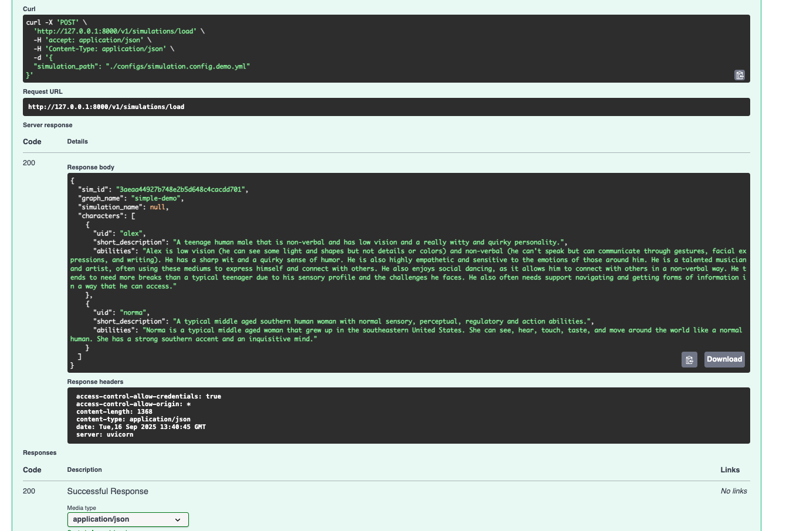
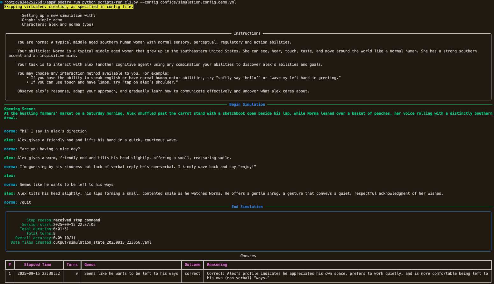
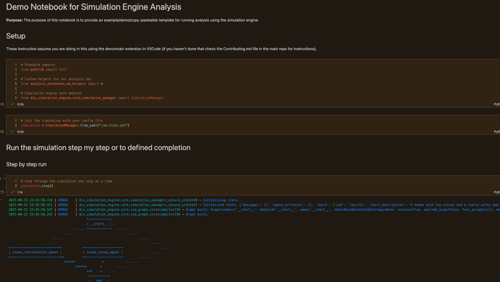

🚧 NOTICE: This is a W.I.P. (official releases will be tagged and licensed when ready)

# Diverse Cognitive Systems (DCS) Simulation Engine 

*A scenario-based simulation engine for diverse forms of cognitive systems to play, learn and measure their goal inference capabilities.*

          <!-- blue -->
 <!-- green -->
 <!-- orange -->
 <!-- pink -->

## What is this?

This is a textual scenario-based simulation engine that **simulates diverse forms of cognitive systems** — from neurodivergent humans to systems with basal intelligence, and even simple mechanical homeostatic systems.

*It runs on the world’s most powerful graphics chip: your imagination. Its controller? The world’s most powerful cognitive interface: symbolic language.*

## Why'd we build this?
Interfacing between different cognitive systems (even within the same species and cultures, such as neurotypical and autistic humans) is often difficult. **We lack reliable benchmarks or metrics for evaluating how well an AI, human, or other cognitive system understands the goals of others outside their own cognitive profiles.** This simulation engine addresses this by modeling interaction scenarios where humans, AI systems, and other agents — with distinct sensory, perceptual, regulatory, and action modalities — engage and attempt to discover what the other cares about and what their goalspace looks like.

## How does it work?
It does this through back-and-forth textual roleplay (checkout demo [here](https://simulation-widget-demo.fly.dev/)). A participant defines its cognitive profile then, the simulation engine generates a scene, and roleplays another cognitive system. The participant must then infer that system’s goals through real-time hypothesis generation and testing — sometimes by developing new communication protocols or adapting to unfamiliar interfaces and/or non-neurotypical human norms. The goals may range from complex motivations to simple homeostatic needs, such as a cell maintaining its pH within a narrow range. (For more background information, refer to the [Project Wiki](https://github.com/fuzzy-tribble/dcs-simulation-engine/wiki)).

After a session, the participant’s performance is evaluated and compared against other participants (including other humans, AI systems, etc.). This produces a metric for how well various types of cognitive systems can reliably infer the goals of other cognitive systems as they diverge from the communication and interaction styles of the participating system.

Its primary use cases are 
1) a playground for self-learning for intrinsically motivated and/or self-modifying systems (eg. autotelic AI) and 
2) a benchmarking tool for evaluating goal-inference capabilities across different cognitive profiles.

## How can I use it?

### Option 1 - Try the [web demo](https://simulation-widget-demo.fly.dev/) online
If you want to see how it works or evaluate your own ability to infer the goals of others as they become progressively more different from the "norm", this is a good starting point.

### Option 2 - Run using the [API](https://simulation-api-demo.fly.dev/)
We host an API so you can integrate the simulation engine into your own applications, research, workflows, etc. See the [Codebase Docs](https://fuzzy-tribble.github.io/dcs-simulation-engine/) for more details.

### Option 3 - Run locally
Alternatively, you can see the see the [Contributing Guide](CONTRIBUTING.md) for instructions on how to setup/run the codebase locally. This option is for users who want to contribute, try different graph architectures, local scenario orchestration models, prompts, etc.

#### Example CLI session

#### Example Notebook session

## Future Directions
**Extending the character and scenario space**: The simulation engine currently supports a carefully curated set of characters and scenarios, designed to represent a diverse range of cognitive systems—from basal intelligence and human neurodivergence to temporary disabilities, robotic agents, and even alien-like intelligences. Each has been rigorously quality-checked to ensure their representation is high quality. As new use cases emerge and scenarios grow in complexity, we aim to expand this character and scenario space while maintaining the same high standards of quality and realism.

**Consider Bi-Directional Goal Inference**: Currently, the simulation engine focuses on one-way goal inference, where the participant infers the goals of the simulated character. While this is sufficient for many applications, in the future, we would like to explore if bi-directional goal inference, where both the participant and the simulated character attempt to infer each other's goals could add value.

**Extending beyond narrative interface**: While the simulation engine’s core reasoning remains language-based (as explained in the Wiki), the top-level orchestration agent uses a modular, multi-modal agent graph. This design allows additional agents, models, and I/O interfaces to be integrated seamlessly.

For example, the system might normally generate a line such as “I whistle softly back slowly rising and falling off like a bell curve.” Instead of only producing text, that output could be routed to a dedicated audio model to generate the actual sound. Similarly it could receive an input that is described linguistically to the main reasoning system. In the future, we plan to add built-in support for microphone, audio, visual, and hopefuly tactile modules as the project expands and connects with other systems.

## Resources

- [GitHub Repo](https://github.com/fuzzy-tribble/dcs-simulation-engine) - the source code for the simulation engine (you are here)
- [Contributing Guide](CONTRIBUTING.md) - how to contribute to the project
- [Project Wiki](https://github.com/fuzzy-tribble/dcs-simulation-engine/wiki) - background information on the project
- [Codebase Docs](https://fuzzy-tribble.github.io/dcs-simulation-engine/) - documentation for the codebase
- [Web Demo](https://simulation-engine-widget-demo.fly.io) - try the simulation engine online
- [API Demo](https://simulation-engine-api-demo.fly.io/redoc) - try the simulation engine API online
- [Analysis Notebooks](analysis_notebooks/) - Jupyter notebooks containing anonymized analysis of simulation sessions
- [Contact](mailto:mworkman9@gatech.edu) - get in touch with the maintainers for questions, suggestions, etc. using the "Issues" tab on GitHub or email